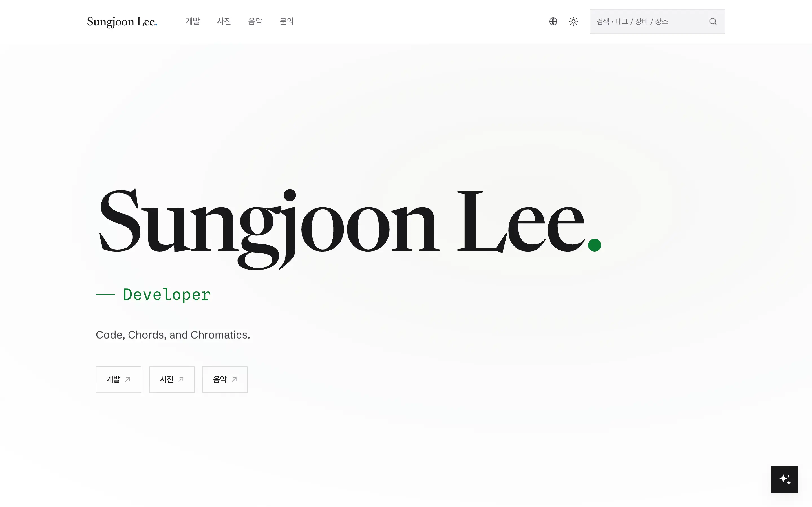
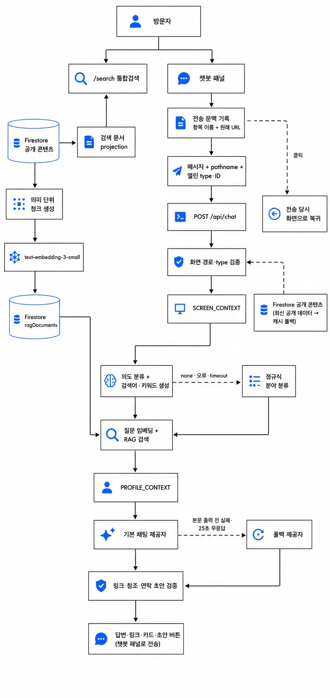

# Sungjoon Lee.

사진, 음악, 소프트웨어 개발 작업을 한곳에서 소개하는 [이성준](https://github.com/SJLee-0525)의 개인 포트폴리오입니다.

[sungjoon.works에서 포트폴리오 보기](https://sungjoon.works)

<a href="https://sungjoon.works">
  <picture>
    <source media="(max-width: 640px)" srcset="./public/readme/landing-mobile.webp">
    
  </picture>
</a>

> 이 저장소는 포트폴리오의 제작 과정과 구현 결과를 공개하기 위한 저장소이며, 오픈소스 프로젝트가 아닙니다. 코드, 디자인, 문서, 이미지와 미디어의 재사용 권한은 부여되지 않습니다. 자세한 내용은 [LICENSE](./LICENSE)와 [NOTICE](./NOTICE)를 확인해 주세요.

## 주요 기능

- Photo, Music, Dev 세 영역을 연결하는 한국어·영어 포트폴리오
- 사진, 앨범, 촬영 정보와 위치 기반 지도
- 연주, 음악 경력, 수상 및 영상 아카이브
- 기술 스택, 개발 프로젝트와 경력 소개
- 공개 콘텐츠를 관리하는 개인용 Firebase CMS
- 일반 검색, 현재 화면 문맥과 포트폴리오 RAG를 연결한 챗봇
- 외부 브라우저 에이전트용 WebMCP 도구 13종과 선언형 연락 폼
- 브라우저 언어와 명시적 선택을 반영하는 한국어·영어 최초 진입
- 선택 전에는 Google tag를 로드하지 않는 분석 동의와 개인정보 설정
- 개인정보처리방침, 사이트 이용 및 콘텐츠 정책, 접근성 안내
- 라이트·다크 테마, 화면 크기에 맞춘 내비게이션과 접근성 검사

## 주요 경로

| 영역    | 경로                                   | 내용                                                |
| ------- | -------------------------------------- | --------------------------------------------------- |
| Entry   | `/`                                    | 쿠키·브라우저 언어에 따라 `/ko` 또는 `/en`으로 이동 |
| Landing | `/ko`, `/en`                           | Photo, Music, Dev로 이어지는 허브                   |
| Photo   | `/photo`                               | 사진, 앨범, 지도와 촬영 정보                        |
| Music   | `/music`                               | 연주, 음악 경력과 영상                              |
| Dev     | `/dev/projects`                        | 개발 프로젝트와 상세 기록                           |
| Search  | `/search`                              | 전체 공개 콘텐츠 검색                               |
| Legal   | `/privacy`, `/terms`, `/accessibility` | 개인정보·이용 정책과 접근성 안내                    |
| Admin   | `/admin`                               | 개인용 콘텐츠 관리                                  |

언어가 포함된 실제 공개 URL은 `/ko/photo`, `/en/dev/projects`처럼 구성됩니다.

## 설계 특징

- 공개 포트폴리오와 관리자 한 명을 위한 Admin CMS를 분리했습니다.
- 한국어와 영어 콘텐츠를 같은 데이터 구조에서 관리합니다.
- 공개 페이지는 [`src/lib/content`](./src/lib/content)의 getter만 사용하므로 mock과 Firestore를 교체할 수 있습니다.
- 공개 데이터는 Firestore REST로 읽고, 관리자 기능은 Firebase SDK로 인증·저장합니다.
- 일반 검색은 브라우저에서 동작합니다. 챗봇은 열린 사진·연주·수상·프로젝트를 공개 ID로 직접 조회하고, 범위가 넓은 질문에는 RAG 검색을 더합니다. 챗봇 요청은 IP당 분당 10회, 전역 일일 1,000회로 제한합니다.
- 내장 챗봇은 WebMCP를 사용하지 않습니다. WebMCP는 방문자가 데려온 외부 브라우저 에이전트가 공개 콘텐츠를 조회하고 현재 화면을 조작할 때만 사용합니다.
- 의존 방향을 `app → features → components`로 제한해 라우팅, 사용자 행동, 공용 UI의 역할을 나눴습니다.

공개 페이지의 읽기 경로와 Admin의 쓰기 경로는 분리되어 있습니다. 외부 서비스까지 포함한 구성은 [프로젝트 아키텍처](./public/readme/architecture.md)에 정리했습니다.

## 기술 구성

- Next.js 16, React 19, TypeScript
- Firebase Authentication, Firestore, Storage
- MapLibre GL
- OpenAI 또는 Gemini 기반 채팅
- OpenAI 임베딩을 사용하는 포트폴리오 RAG 검색
- Vitest, Playwright, Storybook, Lighthouse CI

## 프로젝트 구조

라우팅, 도메인 기능, 공용 UI와 데이터 접근 계층을 분리했습니다.

```text
src/
├── app/          라우트 · 레이아웃 · API
├── features/     도메인 UI와 사용자 행동
├── components/   props 기반 공용 UI
├── lib/          콘텐츠 · Firebase · AI · 검색
├── mocks/        로컬 개발과 E2E 데이터
└── types/        도메인과 API 타입

design/           디자인 프로토타입과 제작 기록
docs/             ADR과 운영 문서
e2e/              공개 흐름 · 접근성 · 시각 회귀
test/             Firebase Security Rules
```

주요 폴더: [`app`](./src/app) · [`features`](./src/features) · [`components`](./src/components) · [`lib`](./src/lib) · [`design`](./design/) · [`docs`](./docs/)

<details>
<summary><strong>세부 구조 펼쳐보기</strong></summary>

<br>

```text
src/
├── app/
│   ├── layout.tsx                 # 전역 셸: 폰트, 테마 초기화, 언어·모션 Provider
│   ├── .well-known/security.txt/  # 보안 취약점 제보 연락처
│   ├── [lang]/                    # ko·en 경로 기반 다국어 공개 트리
│   │   ├── layout.tsx             # 정적 언어 경로 생성, DocumentLang 동기화
│   │   └── (public)/
│   │       ├── layout.tsx         # 공개 셸: 내비게이션, 챗봇, 분석 동의 경계
│   │       ├── page.tsx           # 랜딩: <LandingView/>
│   │       ├── photo/
│   │       │   ├── (work)/page.tsx       # 사진 그리드·필터, ?photo= 상세 모달
│   │       │   ├── albums/page.tsx       # 앨범 목록
│   │       │   ├── albums/[id]/page.tsx  # 앨범 상세
│   │       │   ├── map/page.tsx          # 촬영 위치와 MapLibre 지도
│   │       │   └── about/page.tsx        # 사진가 소개와 통계
│   │       ├── music/
│   │       │   ├── page.tsx       # 연주 목록, ?work= 상세 모달
│   │       │   ├── career/page.tsx # 학력·경력·수상
│   │       │   ├── media/page.tsx  # YouTube 연주 영상
│   │       │   └── about/page.tsx  # 피아니스트 소개
│   │       ├── dev/
│   │       │   ├── page.tsx       # 기술 스택
│   │       │   ├── projects/page.tsx # 프로젝트 목록, ?project= 상세 모달
│   │       │   ├── career/page.tsx # 개발 경력
│   │       │   └── about/page.tsx  # 개발자 소개
│   │       ├── search/page.tsx     # 공개 콘텐츠 통합 검색
│   │       ├── contact/page.tsx    # 문의 폼과 외부 연락 링크
│   │       └── privacy/ · terms/ · accessibility/ # 공용 legal 문서 화면
│   ├── admin/
│   │   ├── layout.tsx             # noindex 관리자 레이아웃
│   │   ├── _components/
│   │   │   └── AdminLayoutClient.tsx # AuthGuard, AdminChrome, RAG 상태 알림
│   │   ├── login/page.tsx
│   │   ├── photos/ · albums/ · tags/ · site/ # 사진·앨범·태그·사이트 CMS
│   │   ├── music/                  # works · awards · media · config
│   │   ├── dev/                    # projects · config
│   │   └── maintenance/            # 임베딩·이미지 마이그레이션
│   └── api/
│       ├── chat/route.ts           # 스트리밍 포트폴리오 챗봇
│       ├── search-index/route.ts   # 공개 검색 문서
│       ├── photos/[id]/route.ts    # 사진 상세 on-demand 조회
│       ├── photo-map/[id]/route.ts # 지도 사진 상세 조회
│       ├── dev-projects/[id]/route.ts # 개발 프로젝트 상세 조회
│       └── admin/                  # 이미지 원본·포트폴리오 임베딩 관리
├── features/                       # 도메인 UI와 사용자 행동
│   # 각 feature 내부: _components/ · _hooks/ · _lib/ · _types/
│   ├── landing/                    # 워드마크 애니메이션과 3개 섹션 진입
│   ├── gallery/                    # 사진 필터, 무한 스크롤, 갤러리
│   ├── photo-detail/               # 사진 모달, EXIF, 미니맵, 상세 캐시
│   ├── albums/ · map/ · about/     # 사진 앨범, 지도, 소개 화면
│   ├── music/                      # 연주·경력·영상·소개 화면
│   ├── dev/                        # 스택·프로젝트·경력·소개 화면
│   ├── search/ · chat/ · contact/  # 검색, RAG 챗봇, 문의
│   ├── analytics/ · legal/          # 분석 동의·GA 로딩 경계와 정책 문서
│   ├── site-header/ · site-footer/ # 데스크톱 mega-menu와 모바일 내비게이션
│   ├── lang/ · theme/ · motion/    # 언어, 테마, 애니메이션 상태
│   ├── auth/ · image-upload/       # 관리자 인증과 이미지 처리
│   └── admin-*/                    # 도메인별 CMS 목록·폼·정렬·저장 로직
├── components/                     # props 기반 공용 UI
│   ├── Modal · PhotoTile · PhotoGrid · AlbumCard
│   ├── ImageCarousel · ImageLightbox · ExifStrip
│   ├── Chip · Select · RangeSlider · ViewToggle
│   └── icons/                      # 소셜·서비스 SVG 아이콘
├── lib/
│   ├── content/                    # 공개 getter, mock↔Firestore 전환 경계
│   ├── firebase/
│   │   ├── public/                 # 공개 Firestore REST 읽기
│   │   └── *.ts                    # Firebase client SDK, CRUD, Storage, 인증
│   ├── ai/                         # RAG 청크·인덱스·검색·임베딩
│   ├── search/                     # 일반 검색 점수와 추천
│   ├── seo/ · metadata/            # canonical, hreflang, 공유 메타데이터
│   └── i18n/ · security/ · cache/  # 다국어 유틸, URL 검증, 재검증
├── mocks/                          # 로컬 개발·E2E용 Photo·Music·Dev 데이터
├── types/                          # 도메인과 API TypeScript 타입
├── constants/                      # 라우트, 내비게이션, 컬렉션, 보안 설정
└── assets/fonts/                   # Newsreader·Spline Sans Mono와 OFL

src/proxy.ts                        # 루트의 쿠키·Accept-Language 기반 307

design/                             # 디자인 프로토타입, export, 제작 기록
docs/                               # ADR, 운영·테스트 문서, 프로젝트 설명
e2e/                                # Playwright 공개 흐름·접근성·시각 회귀
test/                               # Firebase Security Rules 테스트
```

</details>

## 챗봇 RAG 구조

<a href="./public/readme/chatbot-rag.md">
  <picture>
    
  </picture>
</a>

챗봇은 질문을 보낸 순간 열려 있던 사진·연주·수상·프로젝트를 공개 ID로 직접 조회합니다. 사용자 메시지에는 함께 보낸 항목과 당시 URL을 기록해 원래 화면으로 돌아갈 수 있습니다. 더 넓은 포트폴리오 문맥이 필요하면 코사인 유사도와 키워드 점수를 결합한 RAG 검색으로 관련 청크를 찾습니다.

Firestore 벡터는 서버에서 int8 스냅샷으로 압축해 캐시하며, 콘텐츠가 바뀌면 해당 원본의 청크만 다시 생성합니다. 모델이 반환한 링크, 사진 필터, 참조 ID와 연락 초안은 서버 검증을 통과한 것만 UI에 전달합니다. 구조화 응답이 일부만 복구되면 본문만 사용합니다.

일반 `/search`는 이 흐름을 사용하지 않습니다. 공개 콘텐츠를 브라우저에서 바로 검색하므로 임베딩이나 채팅 모델 호출 비용이 들지 않습니다. 자세한 동작은 [챗봇과 RAG](./public/readme/chatbot-rag.md)에 정리했습니다.

## 로컬 실행

Node.js 20.9 이상과 npm이 필요합니다.

```bash
npm ci
cp .env.example .env.local
npm run dev
```

기본 개발 모드는 외부 서비스 없이 둘러볼 수 있는 mock 콘텐츠를 사용합니다. 실제 Firebase 데이터를 확인하려면 `.env.local`에 필요한 값을 채우고 `NEXT_PUBLIC_USE_MOCK=0`으로 설정합니다. 환경변수의 역할과 보안 주의사항은 [.env.example](./.env.example)에 정리되어 있습니다.

### 주요 명령어

```bash
npm run dev             # 개발 서버
npm run build           # 프로덕션 빌드
npm run lint            # ESLint
npm run check           # Next.js 타입 생성 및 TypeScript 검사
npm test                # Vitest 단위 테스트
npm run test:e2e        # Playwright E2E 테스트
npm run test:chat-eval  # mock 챗봇 응답·RAG·참조 평가
npm run test:chat-eval:live # 실제 제공자 응답 품질·지연 평가
npm run test:coverage   # 커버리지 검사
npm run storybook       # 컴포넌트 Storybook
```

## 품질 검증

TypeScript와 ESLint 외에도 순환 의존성, 미사용 코드와 코드 중복을 정적 분석합니다. Vitest는 데이터 변환과 공용 로직을, Playwright는 데스크톱·모바일의 공개 탐색 흐름과 접근성을 검증합니다. 시각 회귀, Lighthouse CI와 Firebase Security Rules 테스트도 별도로 구성했습니다.

도구별 검사 범위와 명령은 [테스트 전략](./public/readme/testing.md)에서 확인할 수 있습니다. Firebase Rules 테스트에는 로컬 에뮬레이터와 Java 런타임이 필요할 수 있습니다.

## 관련 문서

| 문서                                                 | 내용                                  |
| ---------------------------------------------------- | ------------------------------------- |
| [프로젝트 아키텍처](./public/readme/architecture.md) | 공개 사이트, CMS와 데이터 계층        |
| [챗봇과 RAG](./public/readme/chatbot-rag.md)         | 화면 문맥, RAG 검색, 폴백과 응답 검증 |
| [디자인과 구현](./public/readme/design.md)           | 디자인 방향, 반응형 구조와 제작 과정  |
| [테스트 전략](./public/readme/testing.md)            | 정적 분석·단위·E2E·시각 회귀 테스트   |

구현 결정과 운영 절차는 아래 문서에서 이어서 볼 수 있습니다.

| 문서                                                                         | 내용                                        |
| ---------------------------------------------------------------------------- | ------------------------------------------- |
| [도메인 컨텍스트](./CONTEXT.md)                                              | 공개 영역, 아키텍처 경계와 E2E 계약         |
| [언어 진입·동의 운영 문서](./docs/plan/03-browser-language-entry-routing.md) | 위험 분석, 테스트 사례, 배포와 트러블슈팅   |
| [WebMCP 에이전트 도구](./docs/plan/04-webmcp-agent-tools.md)                 | 브라우저 에이전트용 도구 설계, 보안과 평가  |
| [WebMCP 도구 평가 기록](./docs/troubleshooting/webmcp-tool-eval.md)          | 명령형 도구 13종과 선언형 연락 폼 평가      |
| [챗봇 화면 문맥 인식 계획](./docs/plan/06-chat-screen-context.md)            | URL 화면 문맥, 사진 필터와 연락 초안 전달   |
| [UI 품질 테스트](./docs/testing.md)                                          | 시각 회귀, 접근성, 언어·분석 동의 검증 방법 |

## 제작 및 AI 활용

기획, 디자인, 구현을 직접 맡았습니다. 생성형 AI는 아이디어 탐색과 디자인, 코드 작성 및 검토에 보조 도구로 사용했습니다. AI가 만든 초안은 직접 검토하고 수정해 프로젝트에 반영했습니다. AI 사용 여부는 이 저장소의 이용 조건에 영향을 주지 않습니다.

## 저작권과 자산

Copyright © 2026 Sungjoon Lee. All rights reserved.

- 원본 코드, UI, 디자인 프로토타입과 [`design/`](./design/) 산출물은 별도 허락 없이 복제·수정·배포할 수 없습니다.
- 사진, 인물 이미지, 포스터, 프로젝트 스크린샷, 발표 영상과 외부 Drive 자료에는 공동 권리자의 권리가 포함될 수 있습니다. 저장소나 사이트에 표시되었다는 이유만으로 이용 권한이 부여되지 않습니다.
- Newsreader, Noto Serif KR, Schibsted Grotesk와 Spline Sans Mono 폰트는 각각의 SIL Open Font License 1.1을 따릅니다. 세부 저작권 표기는 [NOTICE](./NOTICE)에 정리했습니다.
- 외부 서비스, 라이브러리와 그 상표는 각 권리자에게 귀속됩니다.

사용 또는 라이선스 문의는 [저장소 소유자](https://github.com/SJLee-0525)에게 연락해 주세요.
