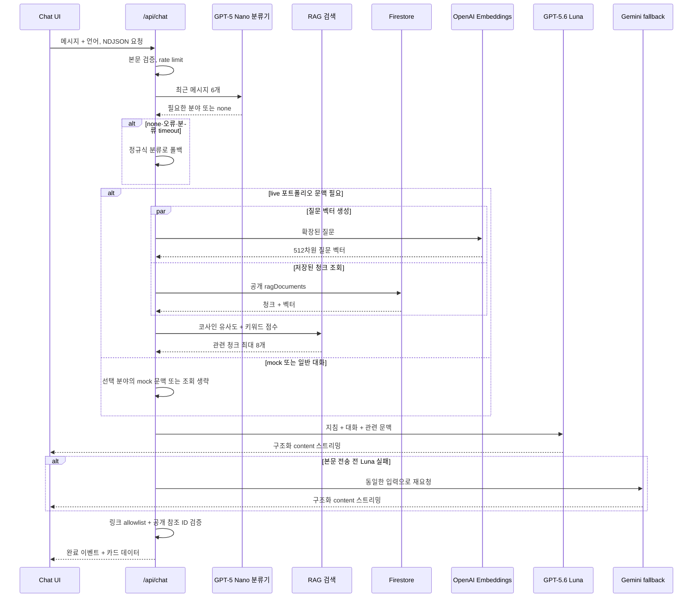
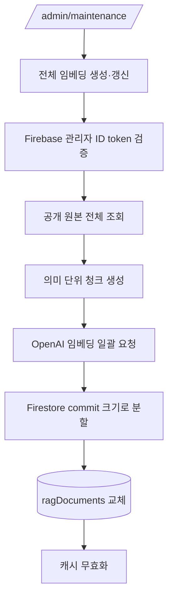
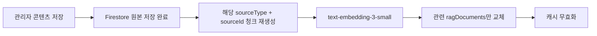
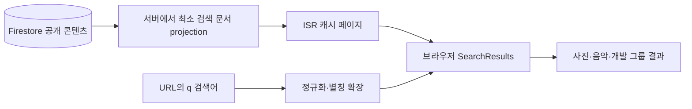

# 챗봇과 통합검색 설계

> 상태: 구현 완료, 운영 설정 및 평가 진행 중  
> 범위: 포트폴리오 챗봇, RAG 임베딩, `/search` 통합검색  
> 관련 결정: [ADR-0001: Vercel Route Handler 기반 Portfolio RAG](./adr/0001-serverless-rag.md)

## 1. 목적

방문자가 사진·음악·개발 프로젝트를 한국어와 영어로 쉽게 탐색할 수 있도록 두 가지 검색 경로를 제공한다.

- **통합검색**은 빠르고 비용이 들지 않는 탐색 수단이다. 제목, 장소, 장비, 프로그램, 기술 스택 등 공개 메타데이터를 브라우저에서 검색한다.
- **챗봇**은 자연어 질문을 이해하고 관련 포트폴리오 문맥을 찾아 설명한다. 필요한 경우 사진·연주·프로젝트 카드를 함께 반환한다.

두 기능은 같은 공개 콘텐츠를 사용하지만 실행 방식과 비용 구조가 다르다. 일반 검색에 AI 호출을 넣지 않아 응답 속도와 비용을 안정적으로 유지하고, 의미 해석이 필요한 질문은 챗봇의 RAG로 처리한다.

## 2. 전체 구조

```mermaid
flowchart LR
    U[방문자] --> S[/search 통합검색]
    U --> C[챗봇 패널]

    F[(Firestore 공개 콘텐츠)] --> SD[검색 문서 projection]
    SD --> S

    F --> CH[의미 단위 청크 생성]
    CH --> E[text-embedding-3-small]
    E --> R[(Firestore ragDocuments)]

    C --> API[POST /api/chat]
    API --> N[GPT-5 Nano 문맥 분류]
    N -. none·오류·timeout .-> I[정규식 분야 분류]
    N --> Q[질문 임베딩 + RAG 검색]
    I --> Q[질문 임베딩 + RAG 검색]
    R --> Q
    Q --> L[GPT-5.6 Luna]
    L -. 응답 시작 전 실패 .-> G[Gemini 3.5 Flash-Lite]
    L --> V[링크·참조 검증]
    G --> V
    V --> C
```

## 3. 사용 모델과 호출 위치

| 용도           | 제공자·모델                     | 호출 위치                                            | 호출 시점                                           |
| -------------- | ------------------------------- | ---------------------------------------------------- | --------------------------------------------------- |
| 챗봇 기본 응답 | OpenAI `gpt-5.6-luna`           | `src/features/chat/_lib/openai-chat-provider.ts`     | 방문자가 챗봇 메시지를 전송할 때                    |
| 챗봇 폴백      | Google `gemini-3.5-flash-lite`  | `src/features/chat/_lib/gemini-chat-provider.ts`     | Luna가 본문을 보내기 전에 실패했을 때               |
| 의도 분류      | OpenAI `gpt-5-nano`             | `src/features/chat/_lib/openai-intent-classifier.ts` | 포트폴리오 분야를 판단할 때                         |
| 콘텐츠 임베딩  | OpenAI `text-embedding-3-small` | `src/lib/ai/embedding.ts`                            | 최초 일괄 생성 또는 콘텐츠 변경 후 증분 동기화할 때 |
| 질문 임베딩    | OpenAI `text-embedding-3-small` | `src/lib/ai/rag-search.ts`                           | live 포트폴리오 문맥이 필요한 챗봇 질문마다         |
| 일반 통합검색  | 외부 모델 없음                  | `src/features/search/_components/SearchResults.tsx`  | `/search?q=...`를 열거나 검색어가 바뀔 때           |

채팅과 임베딩은 API 키, 모델, 할당량을 분리한다. 임베딩 키가 없을 때 채팅 키를 대신 사용하지 않는다.

```dotenv
CHAT_PROVIDER=openai
CHAT_PROVIDER_MODEL=gpt-5.6-luna
CHAT_PROVIDER_API_KEY=

CHAT_FALLBACK_PROVIDER=gemini
CHAT_FALLBACK_PROVIDER_MODEL=gemini-3.5-flash-lite
CHAT_FALLBACK_PROVIDER_API_KEY=

CHAT_INTENT_MODEL=gpt-5-nano
CHAT_INTENT_PROVIDER_API_KEY=
CHAT_INTENT_TIMEOUT_MS=3000

EMBEDDING_PROVIDER=openai
EMBEDDING_PROVIDER_MODEL=text-embedding-3-small
EMBEDDING_PROVIDER_DIMENSIONS=512
EMBEDDING_PROVIDER_API_KEY=
```

의도 분류 키를 비워 두면 기본 제공자가 OpenAI일 때 채팅 키를 공유한다. 사용할 OpenAI 키가 없으면 LLM 분류를 건너뛰고 정규식 분류만 사용한다.

모든 키는 `.env.local` 또는 Vercel의 server-only 환경변수에 저장하며 `NEXT_PUBLIC_` 접두사를 사용하지 않는다.

## 4. 챗봇 요청 흐름



### 4.1 입력 검증과 분류

`POST /api/chat` Route Handler가 다음을 처리한다.

- 요청 본문 최대 20KB
- 최근 메시지 최대 12개
- 메시지당 최대 2,000자, 전체 최대 8,000자
- 언어는 `ko` 또는 `en`
- 15초 timeout
- IP 기준 요청 제한

`openai-intent-classifier.ts`가 현재 질문을 포함한 최근 메시지 6개를 `gpt-5-nano`에 전달해 `profile`, `development`, `music`, `photography`, `none`으로 분류한다. 최근 user/assistant 메시지를 함께 보기 때문에 “울릉도 갔나 보네, 그럼 독도도 있어?”처럼 현재 문장에 `사진`이라는 단어가 없는 후속 질문도 Photo 문맥으로 이어갈 수 있다. 응답은 엄격한 JSON Schema의 섹션 배열만 허용하며 `reasoning.effort: minimal`, 최대 출력 80토큰을 사용한다.

분류 결과가 `none` 또는 빈 배열이거나 API 키 미설정, 잘못된 응답, 429·5xx·네트워크 오류, `CHAT_INTENT_TIMEOUT_MS` 초과가 발생하면 `chat-intent.ts`의 기존 정규식 분류를 한 번 더 실행한다. 기본 분류 timeout은 3초이며 전체 채팅 15초 timeout 안에서 동작한다. 요청 제한을 통과한 뒤 분류하므로 차단된 요청이 모델 할당량을 소비하지 않는다. 정규식은 직접 분야 키워드와 “그거”, “더 보여줘” 같은 단순 후속 질문을 처리하는 무비용 복구 경로다.

분류기를 유지하는 이유는 모든 데이터를 매번 모델에 보내지 않고 필요한 분야만 검색하기 위해서다. 이는 입력 토큰, Firestore 처리량, 응답 시간을 줄이고 서로 무관한 콘텐츠가 답변에 섞이는 문제도 완화한다.

### 4.2 하이브리드 RAG 검색

질문은 `rag-query.ts`에서 정규화하고 필요한 별칭을 확장한다. 예를 들어 `캐논`은 Canon과 사진·카메라 맥락으로, `리액트`는 React와 개발·프로젝트 맥락으로, `piano`는 피아노·음악·연주 맥락으로 보강된다.

검색 점수는 다음 두 신호를 함께 사용한다.

```text
최종 점수 = 코사인 유사도 + (키워드 유사도 × 0.35)
```

- **벡터 유사도**는 표현이 달라도 의미가 가까운 콘텐츠를 찾는다.
- **키워드 유사도**는 모델명, 기술명, 고유명사처럼 정확한 문자열이 중요한 검색을 보강한다.
- 벡터 점수 0.3 이상 또는 키워드 점수 0.5 이상인 후보 중 상위 8개만 모델 문맥에 넣는다.

Firestore의 네이티브 벡터 검색 기능은 사용하지 않는다. Route Handler가 공개 `ragDocuments`를 읽고 코사인 유사도를 계산한다. raw 벡터 응답은 Data Cache의 항목당 2MB 제한을 넘기므로 그대로 캐시하지 않고, `rag-index.ts`가 벡터를 int8로 양자화해 base64로 압축한 스냅샷을 1시간 Data Cache에 담는다. 스냅샷은 임베딩 동기화가 무효화하는 같은 캐시 태그를 공유하므로 콘텐츠 변경이 다음 질문에 반영되고, 방문자 질문의 Firestore 읽기와 egress는 캐시 fill 시점에만 발생한다. 임베딩은 MRL 잘라내기로 기본 512차원을 사용한다(`EMBEDDING_PROVIDER_DIMENSIONS`). 벡터 공간 호환성은 `모델명@차원` 키로 관리하며, 모델이나 차원을 바꾸면 키가 어긋난 기존 청크가 자동 배제되고 전체 재생성이 이행 경로다. 코퍼스가 커져 스냅샷이 한도에 근접하면 Firestore `findNearest` 이전을 검토한다.

RAG 검색에 문제가 생기면 챗봇 전체를 중단하지 않고 해당 분야의 기존 포맷 문맥으로 폴백한다.

### 4.3 Luna 응답 방식

Luna는 OpenAI Responses API로 호출하며 다음 옵션을 사용한다.

- `stream: true`: 답변 본문을 생성되는 순서대로 UI에 전달
- `reasoning.effort: none`: 포트폴리오 안내에 필요한 지연과 비용을 최소화
- `text.verbosity: low`: 짧고 직접적인 답변 유도
- 엄격한 JSON Schema Structured Outputs
- `store: false`
- 모델 최대 출력 1,024토큰, 서버에서 최종 본문 1,200자로 제한

구조화 결과는 다음 계약을 따른다.

```ts
type ChatProviderResult = {
  content: string;
  links?: { label: string; href: string }[]; // 최대 2개
  references?: {
    type: "photo" | "music" | "project";
    id: string;
  }[]; // 최대 3개
};
```

스트림에는 JSON 전체가 생성되지만 UI에는 `content` 문자열의 증가분만 전달한다. 완료 후 전체 JSON을 다시 파싱해 링크와 참조를 확정한다.

### 4.4 Gemini 폴백 원칙

`chat-provider.ts`가 기본 제공자와 폴백 제공자를 조합한다.

- Luna가 응답 본문을 아직 전송하지 않았다면 Gemini를 호출한다.
- Luna의 일부 문장이 이미 사용자에게 전달됐다면 Gemini로 바꾸지 않는다.
- 요청이 취소되거나 timeout이 발생한 경우 폴백하지 않는다.

이미 스트리밍된 문장 뒤에 다른 모델의 답변을 이어 붙이면 내용이 중복되거나 어조가 바뀔 수 있기 때문에 이 경계를 둔다. Gemini도 JSON Schema와 스트리밍을 사용해 최종 애플리케이션 응답 계약은 동일하게 유지한다.

### 4.5 결과 검증

모델 출력은 그대로 신뢰하지 않는다.

- 링크는 서버의 내부 경로 allowlist에 포함된 것만 사용한다.
- 참조 ID는 현재 공개된 사진·연주·프로젝트 목록과 다시 대조한다.
- 존재하지 않거나 비공개인 ID는 제거한다.
- 검증된 참조만 제목, 부제, 썸네일, 딥 링크가 있는 카드로 변환한다.
- 모델이 선택한 공개 참조 ID가 1시간 Portfolio 스냅샷에 아직 없으면 live 모드에서 공개 projection을 `no-store`로 한 번 다시 읽어 신규 카드의 캐시 시차를 복구한다.
- API 원문 오류와 stack trace는 사용자에게 노출하지 않는다.

### 4.6 mock과 live 데이터 격리

`NEXT_PUBLIC_USE_MOCK`은 챗봇 문맥, 참조 카드와 RAG 검색에 동일하게 적용한다.

- `1`: mock 프로필·Photo·Music·Dev 데이터만 사용하고 live Firestore RAG를 호출하지 않는다.
- `0`: live Firestore 공개 데이터와 live RAG를 사용한다.
- 미설정: 개발 환경은 mock 우선, 프로덕션은 Firebase 설정이 있어야 live를 사용한다.

Portfolio 스냅샷 캐시 함수는 언어뿐 아니라 `mock | live` 콘텐츠 소스를 인자로 받아 캐시 키를 분리한다. mock reference가 없을 때 live 데이터로 재조회하지 않으며, live에서만 stale reference 복구를 허용한다. 따라서 모드를 전환해도 반대쪽 문맥이나 카드가 캐시에서 섞이지 않는다.

`NEXT_PUBLIC_*` 환경변수는 Next.js 빌드·서버 시작 시점 값이므로 `.env.local`을 변경한 뒤 개발 서버를 재시작한다. 기존 채팅창에는 전환 전 assistant 메시지가 브라우저 메모리에 남을 수 있으므로 모드 비교 시 채팅창도 새로 연다.

## 5. 임베딩 데이터 생성과 저장

### 5.1 원본 데이터

임베딩 대상은 Firestore의 공개 포트폴리오 데이터다.

- 사이트 프로필과 사진 소개
- 개발 소개, 기술 스택, 경력, 학력, 수상
- 개발 프로젝트 개요, 담당 기능, 성과, 트러블슈팅
- 음악 소개, 경력, 학력, 연주, 프로그램, 수상, 미디어
- 사진 제목, 한국어·영어 장소, 태그, 카메라, 렌즈
- 앨범 제목과 부제

원본 이미지 파일, 전체 EXIF, GPS 좌표, 관리자 전용 데이터는 임베딩하지 않는다.

### 5.2 청크 구조

`rag-chunks.ts`가 한 콘텐츠를 의미 단위로 나눈다. 한 프로젝트도 개요, 작업 내용, 트러블슈팅이 별도 청크가 될 수 있다. 한국어와 영어 값을 같은 텍스트에 함께 넣어 어느 언어로 질문해도 같은 원본을 찾을 수 있게 한다.

Firestore `ragDocuments`의 각 문서는 다음 정보를 가진다.

| 필드             | 설명                                                  |
| ---------------- | ----------------------------------------------------- |
| `section`        | profile, development, music, photography              |
| `sourceType`     | photo, album, project, musicWork 등 원본 종류         |
| `sourceId`       | 원본 Firestore 문서 ID                                |
| `chunkKey`       | overview, work, troubleshooting-0 같은 의미 단위      |
| `text`           | 한국어·영어와 검색 메타데이터를 합친 임베딩 원문      |
| `embedding`      | `text-embedding-3-small`이 생성한 기본 512차원 float 배열 |
| `embeddingModel` | 벡터 공간 호환성 키 `모델명@차원` (예: `text-embedding-3-small@512`) |
| `published`      | 런타임 공개 조회 여부                                 |

### 5.3 최초 일괄 생성



관리 페이지는 전체 청크 중 현재 모델로 생성된 문서의 비율, 갱신 필요 수, 이전 모델 수, 불필요한 청크 수를 표시한다. 임베딩 모델이나 청킹 규칙을 변경했을 때는 전체 생성을 다시 실행한다.

### 5.4 이후 증분 동기화

관리자가 사진, 앨범, 프로젝트, 연주 등의 콘텐츠를 생성·수정·공개 전환·삭제하면 저장된 원본의 종류와 ID만 `/api/admin/portfolio-embeddings`에 전달한다.



전체 242개와 같은 모든 청크를 매번 다시 만들지 않으므로 결과 품질은 일괄 생성과 같고, 호출량과 쓰기 비용만 줄어든다. 증분 갱신은 서버 오류일 때 한 번 재시도한다. 원본 콘텐츠 저장과 RAG 동기화는 분리되어 있어 임베딩 실패가 원본 저장을 되돌리지는 않는다. 실패 시 관리자 일괄 생성이 복구 경로다.

동기화가 읽는 원본은 항상 ISR 캐시를 우회한다(fresh). 관리자 저장 직후의 공개 페이지 재검증은 디바운스된 fire-and-forget이라, 캐시 경유 읽기는 방금 저장한 값 대신 최대 1시간 전 값을 임베딩할 수 있기 때문이다. 증분 타깃 원본은 공개 fetcher와 같은 디코더(`toPhoto`·`toDevProject` 등)로 정규화해 구형 문서(평문 troubleshooting, id 없는 수상)에서도 전체 생성과 같은 청크가 나온다. 개발 수상은 `site/dev` 문서의 배열 필드이므로 청크 `sourceId`도 `dev`로 저장해 devConfig 증분 동기화에 함께 실린다.

## 6. 일반 통합검색

### 6.1 데이터 흐름



`/search` 페이지는 서버에서 공개 데이터를 최소한의 `SearchDocument`로 투영한다. 검색어 `q`와 무관하게 페이지 데이터를 캐시하고, 브라우저에서 검색어를 필터링하므로 타이핑과 언어 전환에 즉시 반응한다.

검색 문서에 포함되는 대표 필드는 다음과 같다.

- 사진: 제목, 장소, 카메라, 렌즈
- 앨범: 제목, 부제
- 연주: 제목, 부제, 장소, 분류, 프로그램
- 음악 수상·미디어: 이름, 장소 또는 출처
- 프로젝트: 제목, 분류, 요약, 기술 태그

한국어 필드와 영어 필드를 함께 비교하므로 `React`와 `리액트`, `piano`와 `피아노` 같은 교차 언어 탐색이 가능하다. `Canon/캐논`, `lake/호수` 등 자주 사용하는 표현은 제한된 별칭 사전으로 보강한다.

### 6.2 일반 검색에 임베딩을 사용하지 않는 이유

- 검색할 때마다 OpenAI 호출 비용과 네트워크 지연이 발생하지 않는다.
- Vercel 서버리스 함수 호출 없이 브라우저에서 즉시 필터링할 수 있다.
- 현재 데이터 규모에서는 제목·장소·장비·기술명 검색이 대부분을 충족한다.
- 검색 결과가 없을 때는 자동으로 챗봇을 열지 않고, 자연어로 질문해 보라는 안내만 표시한다.

별칭 사전은 완전한 의미 검색을 대체하지 않는다. 자주 쓰는 브랜드·기술·장소 표현만 보강하고, 예상하지 못한 질문이나 설명형 탐색은 챗봇이 담당한다.

## 7. 캐시, 서버리스와 비용

- Next.js Route Handler를 사용하며 별도 상시 서버를 운영하지 않는다.
- 공개 프로필 projection은 1시간 Data Cache를 사용하며 `ko/en`과 `mock/live`별로 분리한다.
- raw `ragDocuments` 벡터 응답은 2MB 제한을 넘으므로 int8 양자화 스냅샷으로 압축해 캐시한다. 방문자 질문의 Firestore 읽기·egress는 캐시 fill(콘텐츠 변경 또는 1시간 주기) 시점에만 발생한다.
- 관리자 콘텐츠 저장과 임베딩 완료 후 같은 캐시 태그를 무효화한다.
- 일반 통합검색은 모델 호출 비용이 없다.
- live 포트폴리오 질문에는 의도 분류 1회, 질문 임베딩 1회와 채팅 모델 호출 1회가 발생한다. mock 질문은 RAG와 질문 임베딩을 생략한다.
- 전체 임베딩 비용은 최초 구축, 모델 변경, 전체 복구 시에 발생한다.
- 일반적인 콘텐츠 수정은 변경된 항목의 청크만 다시 임베딩한다.
- Firestore 벡터는 문서의 float 배열로 저장하며 현재는 서버에서 유사도를 계산한다.

데이터가 크게 증가해 한 요청에서 모든 벡터를 읽고 비교하는 비용이 부담될 때 Firestore 네이티브 벡터 검색이나 전용 벡터 DB를 검토한다. 현재 규모에서는 추가 인프라보다 단순한 서버 계산이 운영상 유리하다.

## 8. 선택한 구조와 대안

### LangChain을 사용하지 않는 이유

현재 흐름은 분류 → 검색 → 단일 모델 응답으로 명확하다. LangChain을 추가해도 검색 품질이 자동으로 높아지지 않고 의존성, cold start, 추상화와 디버깅 범위만 늘어난다. 제공자 교체는 자체 `ChatProvider` 경계로 해결한다.

다단계 도구 호출, 재검색·평가 루프, 여러 벡터 DB 교체, LangSmith 추적이 실제 요구사항이 될 때 다시 검토한다.

### LLM 분류기와 정규식 폴백을 함께 쓰는 이유

정규식만으로는 현재 문장에 분야 단어가 없는 자연스러운 후속 질문을 안정적으로 분류하기 어렵다. 저비용 `gpt-5-nano`가 최근 대화의 암시된 대상을 해석하고, `none`과 모든 실패 경로에서는 무료이고 결정적인 기존 정규식으로 다시 시도한다. LLM의 recall과 정규식의 가용성을 결합하면서 분류 장애가 본 답변 장애로 번지지 않게 한다.

### 번역본을 별도 생성하지 않는 이유

원본 콘텐츠가 이미 한국어·영어 필드를 가지고 있으며 검색 문서와 RAG 청크에 두 언어를 함께 넣는다. 검색 시마다 번역 API를 호출하거나 별도 AI 번역본 컬렉션을 유지하지 않는다.

### Gemini를 제거하지 않은 이유

기존에 검증된 제공자를 폴백으로 유지하면 OpenAI의 일시적인 5xx 또는 rate limit 상황에서 가용성을 높일 수 있다. 키와 모델 설정은 분리해 어느 한 제공자의 권한이나 할당량이 다른 기능에 영향을 주지 않게 한다.

## 9. 운영 점검표

- [ ] Vercel Production·Preview에 채팅, 폴백, 임베딩 환경변수를 각각 설정한다.
- [ ] `CHAT_INTENT_MODEL`, 선택적 분류 전용 키와 `CHAT_INTENT_TIMEOUT_MS`를 설정한다.
- [ ] `NEXT_PUBLIC_USE_MOCK` 변경 후 빌드 또는 개발 서버를 재시작하고 새 채팅에서 데이터 소스를 확인한다.
- [ ] OpenAI 채팅 키는 Responses Write 중심의 제한 권한을 사용한다.
- [ ] OpenAI 임베딩 키는 Embeddings Write 중심의 제한 권한을 사용한다.
- [ ] Firebase Rules와 indexes를 배포한다.
- [ ] `/admin/maintenance`에서 임베딩 완료율이 100%인지 확인한다.
- [ ] 콘텐츠를 새로 저장한 뒤 해당 항목의 증분 임베딩 요청이 성공하는지 확인한다.
- [ ] `npm run test:chat-eval`로 한국어·영어 사실성, 참조 카드, TTFT를 비교한다.
- [ ] OpenAI와 Gemini 사용량 한도 및 결제 알림을 설정한다.
- [ ] 운영 개인정보 안내에 각 제공자의 데이터 처리 범위를 반영한다.

## 10. 주요 구현 파일

| 영역                    | 파일                                                 |
| ----------------------- | ---------------------------------------------------- |
| 챗봇 API                | `src/app/api/chat/route.ts`                          |
| 요청 처리·검증·스트림   | `src/features/chat/_lib/handle-chat-request.ts`      |
| 분야 분류               | `src/features/chat/_lib/chat-intent.ts`              |
| OpenAI 의도 분류        | `src/features/chat/_lib/openai-intent-classifier.ts` |
| mock/live 소스 선택     | `src/lib/content/content-source.ts`                  |
| 제공자 선택·폴백        | `src/features/chat/_lib/chat-provider.ts`            |
| OpenAI Luna             | `src/features/chat/_lib/openai-chat-provider.ts`     |
| Gemini                  | `src/features/chat/_lib/gemini-chat-provider.ts`     |
| 프로필 문맥·참조 검증   | `src/features/chat/_lib/build-profile-context.ts`    |
| RAG 검색                | `src/lib/ai/rag-search.ts`                           |
| 검색어 별칭·키워드 점수 | `src/lib/ai/rag-query.ts`                            |
| 청크 생성               | `src/lib/ai/rag-chunks.ts`                           |
| 임베딩 API              | `src/lib/ai/embedding.ts`                            |
| 임베딩 관리 API         | `src/app/api/admin/portfolio-embeddings/route.ts`    |
| 증분 동기화             | `src/lib/ai/request-rag-sync.ts`                     |
| Firestore RAG 읽기      | `src/lib/firebase/public/rag.ts`                     |
| 통합검색 문서           | `src/features/search/_lib/search-documents.ts`       |
| 통합검색 UI             | `src/features/search/_components/SearchResults.tsx`  |
